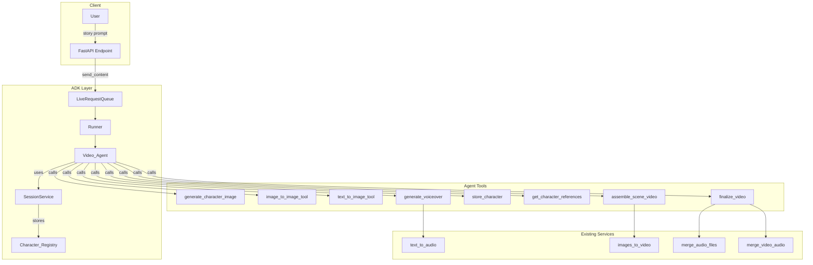

# Design Document: Agentic Video Generator

## Overview

This design describes an ADK-based AI agent that orchestrates the entire video generation pipeline. The agent receives a story prompt, generates character reference images, enhances the story into scenes, generates scene images using image-to-image (with character references) or text-to-image, creates voiceovers, and assembles the final video.

The key innovation is the **Character_Registry** - a session-stored mapping of character names to their reference images, enabling consistent character appearance across all scenes.

## Architecture



## Components and Interfaces

### 1. Video_Agent (ADK Agent)

The main orchestrator agent using Google ADK.

```python
from google.adk.agents import Agent

agent = Agent(
    name="video_agent",
    model="gemini-2.0-flash-lite-001",
    tools=[
        generate_character_image,
        image_to_image_tool,
        text_to_image_tool,
        generate_voiceover,
        store_character,
        get_character_references,
        assemble_scene_video,
        finalize_video,
    ],
    instruction="""You are a video generation agent. When given a story prompt:
    1. Analyze the story and identify all unique characters
    2. For each character, call generate_character_image and then store_character
    3. Enhance and extend the story into detailed scenes
    4. For each scene:
       a. Call get_character_references to find character images
       b. If characters found, call image_to_image_tool with references
       c. If no characters, call text_to_image_tool
       d. Call generate_voiceover for the scene narration
       e. Call assemble_scene_video with image and audio duration
    5. After all scenes, call finalize_video to merge everything
    """
)
```

### 2. Character_Registry (Session State)

Stored in ADK session state, maps character names to reference images.

```python
# Structure stored in session.state["character_registry"]
character_registry: Dict[str, CharacterEntry] = {
    "Luna": {
        "image_path": "/out/char_luna_abc123.png",
        "description": "young girl with silver hair and blue eyes"
    },
    "Dragon": {
        "image_path": "/out/char_dragon_abc123.png", 
        "description": "large red dragon with golden scales"
    }
}
```

### 3. Agent Tools

#### store_character
```python
def store_character(
    name: str,
    image_path: str,
    description: str,
    tool_context: ToolContext
) -> str:
    """Store a character in the registry for later reference."""
```

#### get_character_references
```python
def get_character_references(
    character_names: List[str],
    tool_context: ToolContext
) -> Dict[str, str]:
    """Retrieve character image paths from registry."""
```

#### generate_character_image (STUB)
```python
def generate_character_image(
    name: str,
    description: str,
    video_id: str
) -> str:
    """Generate a character reference image. STUB - returns placeholder."""
```

#### image_to_image_tool (STUB)
```python
def image_to_image_tool(
    scene_description: str,
    character_references: Dict[str, str],
    video_id: str,
    scene_index: int
) -> str:
    """Generate scene image using character references. STUB - returns placeholder."""
```

#### text_to_image_tool (STUB)
```python
def text_to_image_tool(
    scene_description: str,
    video_id: str,
    scene_index: int
) -> str:
    """Generate scene image from text only. STUB - returns placeholder."""
```

#### generate_voiceover
```python
def generate_voiceover(
    text: str,
    video_id: str,
    scene_index: int
) -> Tuple[str, float]:
    """Generate voiceover audio and return path with duration."""
```

#### assemble_scene_video
```python
def assemble_scene_video(
    image_path: str,
    duration: float,
    video_id: str,
    scene_index: int
) -> str:
    """Create scene video by repeating image for duration * 24 frames."""
```

#### finalize_video
```python
def finalize_video(
    video_id: str,
    scene_count: int
) -> str:
    """Merge all scene videos and audio into final video."""
```

## Data Models

### Scene_Spec JSON Schema

```json
{
  "scene_index": 0,
  "description": "Luna walks through the enchanted forest",
  "characters": ["Luna"],
  "mood": "mysterious",
  "composition": {
    "camera_angle": "wide shot",
    "subject_position": "center",
    "lighting": "dappled sunlight"
  },
  "narration": "Luna ventured deeper into the forest..."
}
```

### CharacterEntry

```python
class CharacterEntry(TypedDict):
    image_path: str
    description: str
```

### VideoGenerationState (Session State)

```python
class VideoGenerationState(TypedDict):
    video_id: str
    character_registry: Dict[str, CharacterEntry]
    scenes: List[SceneSpec]
    scene_images: List[str]
    scene_audios: List[str]
    status: str
```

## Correctness Properties

*A property is a characteristic or behavior that should hold true across all valid executions of a system-essentially, a formal statement about what the system should do. Properties serve as the bridge between human-readable specifications and machine-verifiable correctness guarantees.*

### Property 1: Character Registry Consistency
*For any* character that is generated and stored via store_character, calling get_character_references with that character's name SHALL return the stored image path.
**Validates: Requirements 2.3, 9.1, 9.2, 9.3**

### Property 2: Tool Selection Based on Character Presence
*For any* scene, if the scene contains characters that exist in the Character_Registry, the agent SHALL use image_to_image_tool; otherwise, the agent SHALL use text_to_image_tool.
**Validates: Requirements 4.1, 4.2, 9.4**

### Property 3: Frame Count Calculation
*For any* audio duration d (in seconds), the frame count SHALL equal round(24 * d), and the resulting image list SHALL have exactly that many entries.
**Validates: Requirements 5.3, 5.4**

### Property 4: Scene_Spec Serialization Round Trip
*For any* valid Scene_Spec object, serializing to JSON and deserializing back SHALL produce an equivalent object.
**Validates: Requirements 7.4**

### Property 5: Scene_Spec Required Fields
*For any* Scene_Spec created by the agent, it SHALL contain non-empty values for: scene_index, description, characters (list), and narration.
**Validates: Requirements 7.1, 7.2**

### Property 6: Character Identification
*For any* story containing named characters, the agent SHALL identify and generate a Character_Reference for each unique character before scene generation begins.
**Validates: Requirements 2.1, 2.2**

### Property 7: Final Video Path Format
*For any* completed video generation, the final video SHALL be saved at `videos/{video_id}.mp4`.
**Validates: Requirements 6.4**

## Error Handling

1. **Character Generation Failure**: If character image generation fails, log error and continue with text-to-image for all scenes containing that character.

2. **Scene Image Generation Failure**: If a scene image fails, retry once. If still failing, use a placeholder image and log warning.

3. **Voiceover Generation Failure**: If TTS fails, use a default "Scene {n}" audio with 3-second duration.

4. **Video Assembly Failure**: If merge fails, return partial results with error status.

5. **Session State Loss**: If session state is lost mid-generation, fail gracefully and return error to user.

## Testing Strategy

### Unit Testing
- Test individual tool functions in isolation
- Test Scene_Spec validation logic
- Test frame count calculation
- Test Character_Registry operations (store/retrieve)

### Property-Based Testing
Using `hypothesis` library for Python:

1. **Property 1 Test**: Generate random character names and paths, store them, verify retrieval returns correct paths.

2. **Property 3 Test**: Generate random durations (0.1 to 60 seconds), verify frame count = round(24 * duration).

3. **Property 4 Test**: Generate random Scene_Spec objects, serialize to JSON, deserialize, verify equality.

4. **Property 5 Test**: Generate Scene_Specs through the agent, verify all required fields are present and non-empty.

Each property-based test will:
- Run minimum 100 iterations
- Be tagged with format: `**Feature: json-image-generator, Property {number}: {property_text}**`
- Use `hypothesis` strategies for input generation
